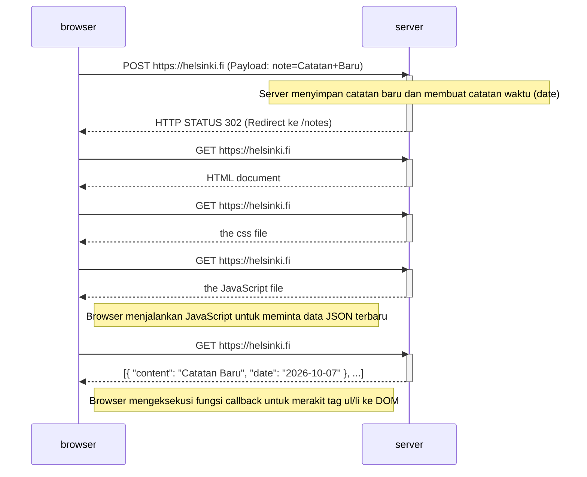
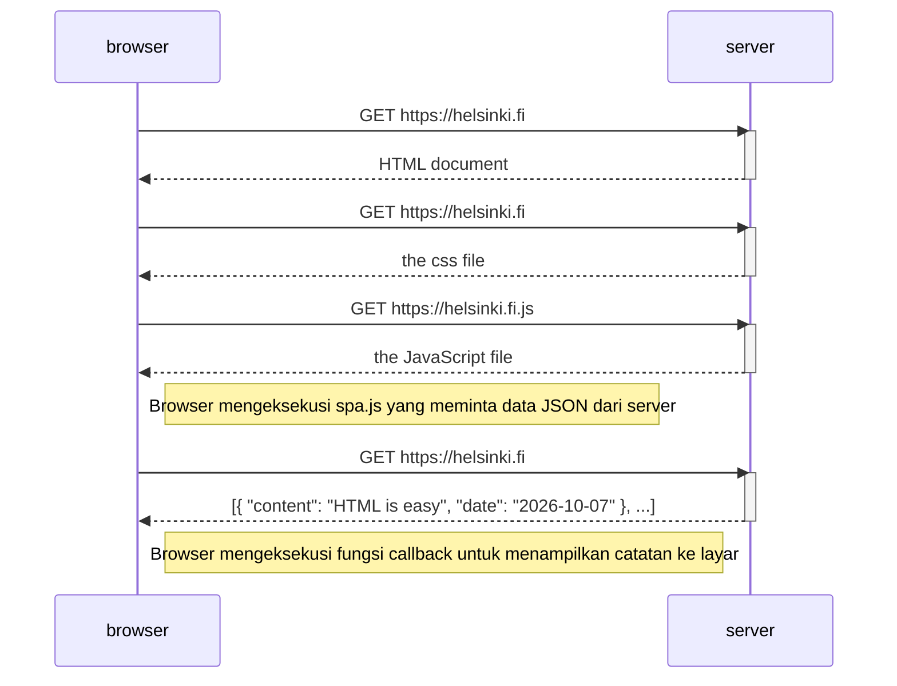
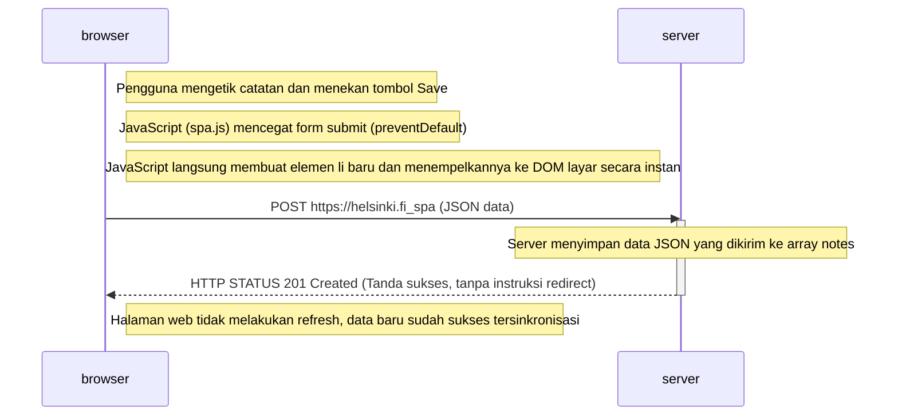

# Jawaban Latihan Bab 0

## Latihan 0.4: New note diagram

```mermaid
sequenceDiagram
    participant browser
    participant server

    browser->>server: POST https://helsinki.fi (Payload: note=Catatan+Baru)
    activate server
    Note over server: Server menyimpan catatan baru dan membuat catatan waktu (date)
    server-->>browser: HTTP STATUS 302 (Redirect ke /notes)
    deactivate server

    browser->>server: GET https://helsinki.fi
    activate server
    server-->>browser: HTML document
    deactivate server

    browser->>server: GET https://helsinki.fi
    activate server
    server-->>browser: the css file
    deactivate server

    browser->>server: GET https://helsinki.fi
    activate server
    server-->>browser: the JavaScript file
    deactivate server

    Note right of browser: Browser menjalankan JavaScript untuk meminta data JSON terbaru

    browser->>server: GET https://helsinki.fi
    activate server
    server-->>browser: [{ "content": "Catatan Baru", "date": "2026-10-07" }, ...]
    deactivate server

    Note right of browser: Browser mengeksekusi fungsi callback untuk merakit tag ul/li ke DOM
```

## Latihan 0.5: Single page app diagram

```mermaid
sequenceDiagram
    participant browser
    participant server

    browser->>server: GET https://helsinki.fi
    activate server
    server-->>browser: HTML document
    deactivate server

    browser->>server: GET https://helsinki.fi
    activate server
    server-->>browser: the css file
    deactivate server

    browser->>server: GET https://helsinki.fi.js
    activate server
    server-->>browser: the JavaScript file
    deactivate server

    Note right of browser: Browser mengeksekusi spa.js yang meminta data JSON dari server

    browser->>server: GET https://helsinki.fi
    activate server
    server-->>browser: [{ "content": "HTML is easy", "date": "2026-10-07" }, ...]
    deactivate server

    Note right of browser: Browser mengeksekusi fungsi callback untuk menampilkan catatan ke layar
```

## Latihan 0.6: New note in Single page app diagram

```mermaid
sequenceDiagram
    participant browser
    participant server

    Note right of browser: Pengguna mengetik catatan dan menekan tombol Save
    Note right of browser: JavaScript (spa.js) mencegat form submit (preventDefault)
    Note right of browser: JavaScript langsung membuat elemen li baru dan menempelkannya ke DOM layar secara instan

    browser->>server: POST https://helsinki.fi_spa (JSON data)
    activate server
    Note over server: Server menyimpan data JSON yang dikirim ke array notes
    server-->>browser: HTTP STATUS 201 Created (Tanda sukses, tanpa instruksi redirect)
    deactivate server

    Note right of browser: Halaman web tidak melakukan refresh, data baru sudah sukses tersinkronisasi
```
